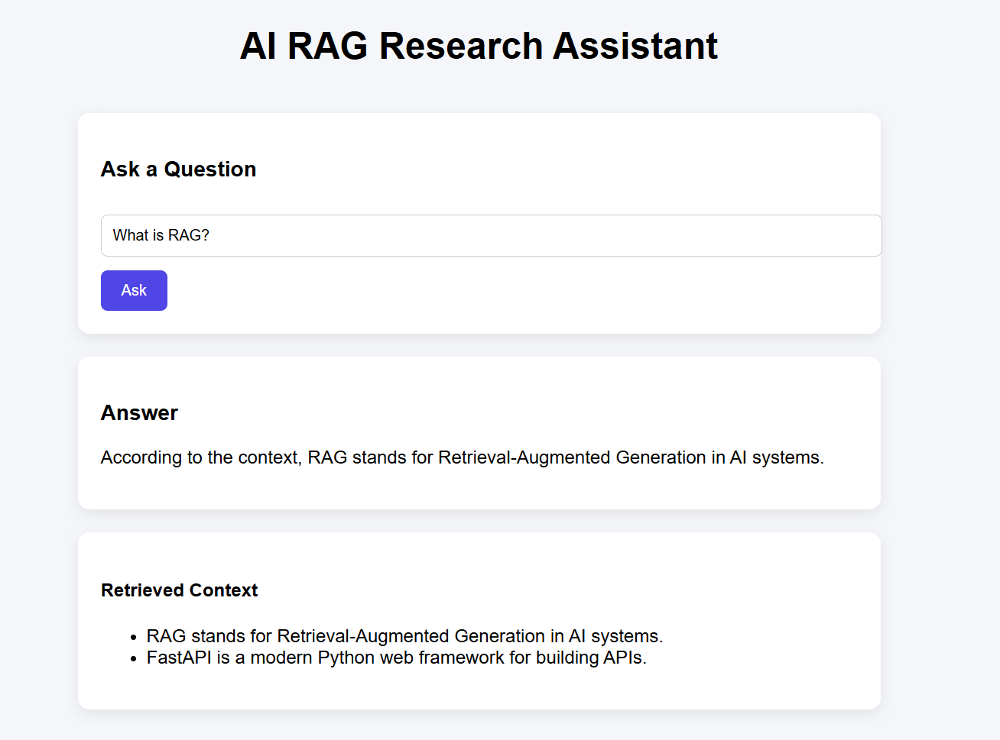

# AI RAG Research Assistant

A full-stack AI application that answers questions using Retrieval-Augmented Generation (RAG).

The system retrieves relevant documents using embeddings and cosine similarity before generating grounded responses using a local LLM.

## Application Preview

## Tech Stack

Frontend
- React
- TypeScript
- Axios

Backend
- FastAPI
- Python
- Custom VectorStore implementation

AI Components
- Ollama
- Llama3 (local LLM)
- nomic-embed-text (embedding model)

---

## Architecture

User Question  
↓  
React Frontend  
↓  
FastAPI Backend (`/ask`)  
↓  
Embedding Generation  
↓  
Cosine Similarity Retrieval (Top-K documents)  
↓  
Context Injection  
↓  
LLM Generation (Llama3 via Ollama)  
↓  
Response returned to UI

---

## Features

- Retrieval-Augmented Generation pipeline
- Custom vector store implementation
- Cosine similarity based document retrieval
- Local LLM inference with Ollama
- TypeScript React frontend
- Loading state and UX improvements
- Retrieved context visualization

---

## Why Manual RAG?

Instead of relying on frameworks like LangChain, this project implements RAG manually to understand the core mechanics:

- Embedding generation
- Vector similarity search
- Context injection
- Prompt grounding

This approach provides deeper insight into how RAG systems work internally.

---

## Running the Project

### Backend

Navigate to the backend folder: cd backend
Backend will run at: venv\Scripts\activate
Activate the virtual environment: uvicorn main:app --reload
Start the FastAPI server: http://127.0.0.1:8000
Backend will run at: http://127.0.0.1:8000/docs

---

### Frontend

Navigate to the frontend folder: cd frontend
Install dependencies: npm install
Run the development server: npm run dev
Frontend will run at: http://localhost:5173

---

## Example Workflow

1. User enters a question in the React UI
2. Frontend sends request to `/ask`
3. Backend generates query embeddings
4. VectorStore retrieves top-k relevant documents
5. Retrieved context is injected into the prompt
6. Llama3 generates a grounded response
7. Answer and retrieved context are displayed in the UI

---

## Future Improvements

- Vector database integration (FAISS / Chroma)
- LangChain-based RAG pipeline
- Conversational chatbot memory
- Document upload support (PDF / web content)
- Streaming LLM responses

---

## Learning Outcomes

This project demonstrates:

- Full-stack AI application architecture
- Manual RAG implementation
- Vector similarity search
- FastAPI backend design
- TypeScript React integration
- Local LLM deployment using Ollama

